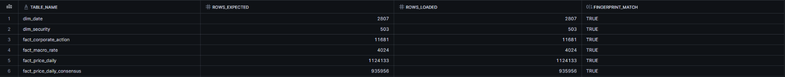
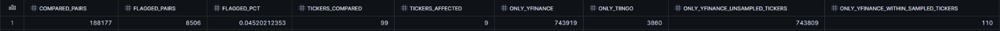
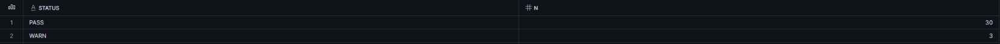

# snowflake-bi-lab

Cloud-warehouse and BI layer on top of [`marketdata-lakehouse`](https://github.com/narasimhamungi/marketdata-lakehouse):
the Postgres gold layer is exported, loaded into **Snowflake**, modelled in SQL,
quality-checked in SQL, and surfaced in a **Power BI** report.

> **Status — read this first.** Keep this block truthful; edit it when each item is done.
>
> | Item | State |
> |---|---|
> | Export script (`sfbi/export_gold.py`) | Built, tested against real Postgres; 1.4M-row scale test passed (~15 s, 51 MB Parquet) |
> | SQL (RAW DDL, MODEL views, MART models, 30+ DQ checks, report-control checks) | Built; logic tested end-to-end in **DuckDB**, same files production uses |
> | Dry run on the real export (`sfbi/dryrun_duckdb.py`: same SQL, DuckDB) | Run on the real export; results identical to the Snowflake run below |
> | Snowflake load (`sfbi/load_snowflake.py`) | **Run live, 2026-10-01** (Snowflake trial, key-pair auth, run `2ebde46ce4d7`): every SQL statement accepted as written |
> | Live row-count / fingerprint reconciliation Postgres ↔ Snowflake | **Done:** 6/6 tables, row counts and fingerprints exact (see Results) |
> | Power BI report, screenshots, PDF | **Not done** (spec in `docs/powerbi_spec.md`) |
> | CI | Workflow written; **not yet run on GitHub** |

## Problem

The lakehouse proves cross-vendor reconciliation and data-quality gating on a Postgres gold layer.
It has no cloud-warehouse or BI layer. This repo adds one, and treats the warehouse as something to be
*verified* (is the copy exact? are the keys intact? can the reconciliation be reproduced?) rather than just loaded.

## Architecture

```
Postgres gold (lakehouse)
   │  sfbi/export_gold.py  — one REPEATABLE READ snapshot → Parquet (decimal128, no floats) + manifest.json
   ▼  (row counts + portable aggregate fingerprints computed in Postgres)
Snowflake  MARKETDATA
   RAW    landed 1:1 (TRUNCATE + COPY INTO; idempotent full refresh)
   MODEL  views: facts joined to dims; has_yfinance / has_tiingo flags
   MART   price_returns (returns, 21-obs rolling vol), recon views, audit tables, latest-run views
   │  sfbi/pipeline.py — verify_load: recompute fingerprints in Snowflake, compare exactly, write mart.load_log
   │                     40_dq_checks.sql → mart.dq_results   50_dq_report_control.sql → vs lakehouse report
   ▼
Power BI (Import)  3 pages: market overview · reconciliation & data quality · platform health
```

## What is distinctive here

* **Exact-copy verification, not just row counts.** The same aggregate SQL (decimal sums, min/max keys, flag counts) runs in Postgres and in Snowflake and is compared exactly. A test shows a one-micro-unit price change that leaves row counts intact is caught.
* **Reconciliation is reproducible.** The warehouse recomputes the vendor comparison from the two per-source fact tables (`mart.v_recon_pairs`) and checks it against the stored consensus flags and against the lakehouse's own published report (`sql/50_dq_report_control.sql`).
* **Coverage gaps split properly.** The lakehouse report's single "only in yfinance" figure mixes tickers Tiingo was never asked for with dates missing inside tickers both vendors cover. `mart.v_recon_summary` separates them.
* **Checks that can fail.** Every DQ check has a test that breaks the data and asserts the check fires.

## Reproduce

Windows / PowerShell. Use a Python 3.12 venv if pip cannot find wheels for your newest interpreter.

```powershell
python -m venv .venv ; .\.venv\Scripts\Activate.ps1
pip install -r requirements.txt
copy .env.example .env        # fill in; never commit .env
$env:PYTHONPATH = "."

python -m pytest tests -q                                   # needs a *_test Postgres, see tests/conftest.py
python -m sfbi.export_gold --out export                     # Postgres -> export\*.parquet + manifest.json
python -m sfbi.dryrun_duckdb --export export               # full pipeline on the real export, locally; no Snowflake needed
python -m sfbi.load_snowflake --export export `
    --report-file ..\marketdata-lakehouse\outputs\reconciliation_report_<DATE>.txt
```

`<DATE>` **must be the ingest date the gold layer was built from** (`python -m src.orchestrate.build_gold <DATE>`).
If it is not, the report-control checks fail — by design.

First run: set `SNOWFLAKE_WAREHOUSE` to one that already exists (e.g. `COMPUTE_WH` on a trial) and `SNOWFLAKE_ROLE` to a role allowed to create databases/warehouses; `sql/00_setup.sql` creates `MARKETDATA_WH` and the database. Later runs can use `--skip-setup` with a least-privilege role.

Snowflake auth: create an RSA key pair, register the public key on your user, point `SNOWFLAKE_PRIVATE_KEY_PATH` at the private key (see `.env.example`).
Check the current trial terms and any MFA/auth requirements for your account type before starting.

## Verified vs unverified

Verified by tests (DuckDB + real Postgres): export correctness, fingerprint equality across engines, every view's logic against independently computed values (reconciliation counts, returns, rolling volatility, gap handling), every check's ability to fail, report parsing against the two real committed lakehouse reports.

Verified live on Snowflake (2026-10-01): key-pair connection, `PUT` + `COPY INTO … MATCH_BY_COLUMN_NAME` of all six Parquet files, every RAW/MODEL/MART/DQ statement as written (no dialect changes were needed), exact load verification.

**Not yet done:** the Power BI report; matching a lakehouse-published reconciliation report (see "Reconciliation vs the lakehouse's committed report" below).

## Results (live Snowflake run, 2026-10-01)

Source: the lakehouse gold layer built for `ingest_date=2026-09-07` into a dedicated Postgres database, exported once, loaded once. Every figure below comes from the Snowflake run; screenshots in `docs/img/`.

**Load verification** (`mart.v_load_latest`): 6/6 tables, `rows_expected = rows_loaded` and `fingerprint_match = TRUE` for every table.

| Table | Rows |
|---|---|
| `dim_date` | 2,807 |
| `dim_security` | 503 |
| `fact_price_daily` | 1,124,133 |
| `fact_price_daily_consensus` | 935,956 |
| `fact_corporate_action` | 11,681 |
| `fact_macro_rate` | 4,024 |



**Reconciliation, recomputed in the warehouse** from the two vendors' rows (`mart.v_recon_summary`): 188,177 ticker-date pairs compared across 99 tickers; 8,506 flagged above the 0.5% tolerance (4.52%), concentrated in 9 tickers. Coverage, kept separate from discrepancies: 743,809 yfinance-only rows belong to tickers outside the Tiingo sample (sampling design, not a gap); 110 are genuine date gaps inside sampled tickers; 3,860 rows are Tiingo-only.



**Data-quality checks** (`mart.v_dq_latest`): 30 PASS, 3 WARN, 0 FAIL. The three warnings are real properties of the source data, named by the dry run on the same export:




* `null_price_fields` (1,930 rows): MSFT's Tiingo series has no adjusted open/high/low (stored as NaN in the lakehouse; NULL here, see decision 16).
* `ohlc_low_le_open` (1 row): HUBB, 2021-05-05, yfinance — the bad print the lakehouse bronze gate also caught.
* `security_without_prices` (8 tickers): COIN, DXCM, EOG, FSLR, LIN, PAYX, TDY, TFC have no yfinance rows in this partition.

### Reconciliation vs the lakehouse's committed report

The lakehouse's committed `reconciliation_report_2026-09-07.txt` reports 192,037 pairs and 9,094 flagged; this build has 188,177 and 8,506. The difference is accounted for to the pair: AJG and DVN have no yfinance rows in the current 09-07 partition (−3,860 pairs; DVN carried 588 of the flags), and 44 pairs dated after the ingest date exist in silver but are dropped by the lakehouse gold build because its `dim_date` ends at the ingest date. The partitions contain rows dated after 2026-09-07, which suggests they were re-pulled after that report was written. A report regenerated from the same data, and the `--report-file` control checks against it, are still to do.

## Docs

`docs/data_dictionary.md` · `docs/decision_log.md` · `docs/limitations.md` · `docs/powerbi_spec.md`
